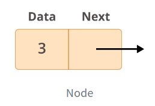
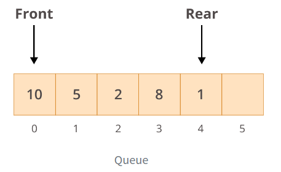
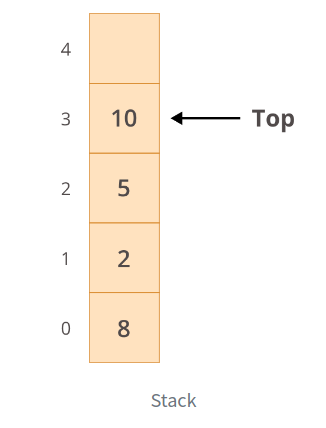

# My python Linked List Implementation

This is my own implementation of a Linked List. 
Why should you consider doing this?

3 main reasons:
 1. Practicing your Python algorithm skills
 2. Learning about data structure theory
 3. Preparing for job interviews

# Python Tips/Notes
## ¿What is the difference between \__str__( ) and \__repr__( ) functions?
* \__str\__():  This method is called when print() or sts() function is invoked on an object.
               If the class/object don't have this method implemented then print() or str() calls
               \__repr\__() function
* \__repr\__(): Returns an object representation in string format. This method is called when repr() function
               is invoked on the objetc. The possible string returned should be a valid expression that can
               be used to reconstruct the object again
```text

__str( )__function is supposed to return a human-readable format which is good for logging
       or to display some information about the object

__repr( )__function is supposed to return an official string representation of the object, which can
       be used to construct the object again`
```
# Theory

Linked list are an ordered collection of objects/nodes, so What makes them different from normal lists?

Linked lists differ from lists in the way that they store elements in memory. While lists use a contiguous memory
block to store references to their data, linked lists store references as part of their own elements.

Each element of a linked list is called a node, and every node has two different fields:

* **Data**: contains the value to be stored in the node.
* **Next**: contains a reference to the next node on the list.

    

## Practical Applications
Linked lists serve a variety of purposes in the real world.
They can be used to implement (spoiler alert!) queues or stacks as well as graphs.
They’re also useful for much more complex tasks, such as lifecycle management
for an operating system application.

### Queues or Stacks
Queues and stacks differ only in the way elements are retrieved.

#### Queue

For a queue, you use a First-In/First-Out (FIFO) approach.
This means that the first element inserted in the list is the first one to be retrieved:



In the picture you can see, when you append new elements to the queue, they’ll go
to the **REAR** end, but when you retrieve elements, 
they’ll be taken from the **FRONT** of the queue

#### Stack

For a stack, you use a Last-In/Fist-Out (LIFO) approach,
meaning that the last element inserted in the list is the first to be retrieved:



## Performance comparison between Lists and Linked Lists

* In Python, list and linked list use almost the same amount of memory
* The real differences is related to the performance
* In lists the time average of inserting or append elements at the beginning of a list grow with the size of the list O(n) but has a constant time ,O(1) inserting elements at the end of the list
* In linked lists time average of inserting or deleting elements is always constant whether is the end or beginning
* Linked list > performance than List when implementing a queue (**FIFO**)
* Linked list ~= List performance when implementing stack (**LIFO**)

## Retrieval elements

* If you know which element you want to access: Linked List = O(n) while List = O(1)

## Python implementation of Linked List

* https://docs.python.org/3.7/library/collections.html#collections.deque
* **collections.deque** in python has a constant **O(1)** performance for access , insert, remove elements from the beginning or end of a list

# References

https://realpython.com/linked-lists-python/#practical-applications
